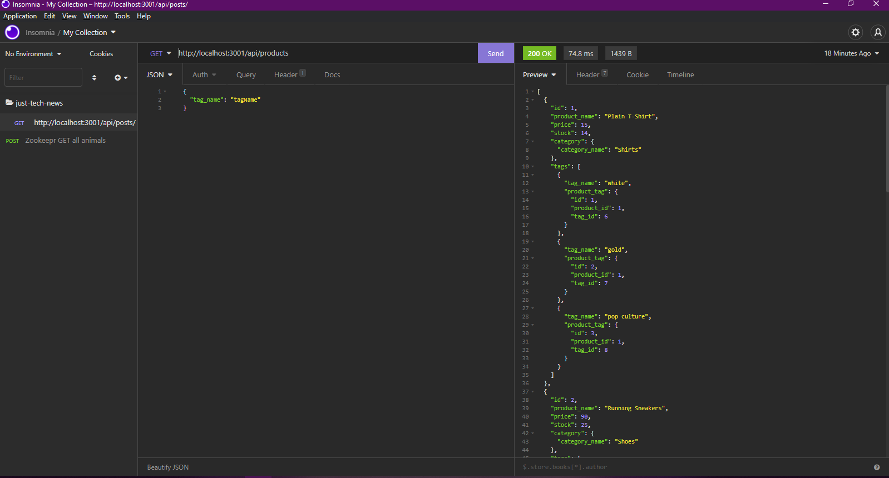

## E-commerce Back End

## Description
This app behaves as the back end to an E-Commmerce site.  It allows for a manager to keep track of there inventory by categories.

## Table of Contents

* [Installation] (#Installation)
* [Usage](#Usage)
* [Contributing](#Contributing)
* [License Info](#LicenseInfo)

## Installation
* This app is ran on Node.js so you would need to have that installed
* Because we are dealing with a database you would need to install MySQL2 and Sequelize packages to connect your Express.js API to a MySQL database.  Lastly it's highly suggested that anyone that uses MySQL to install the dotenv package to use environment variables to store sensitive data, like your MySQL username, password, and database name.

*You may want to download Insomnia or another REST Api like app to test your API routes*

## Usage
Clone git@github.com:KDash201/e-commerce-backend.git and then run "npm i" on your terminal and then to start the start run "npm start"

## Screenshot

## Demo

https://watch.screencastify.com/v/t69txLOklS0YFKOhNPJM

## For Additonal Questons

* Link to GitHub profile: https://github.com/Kdash201